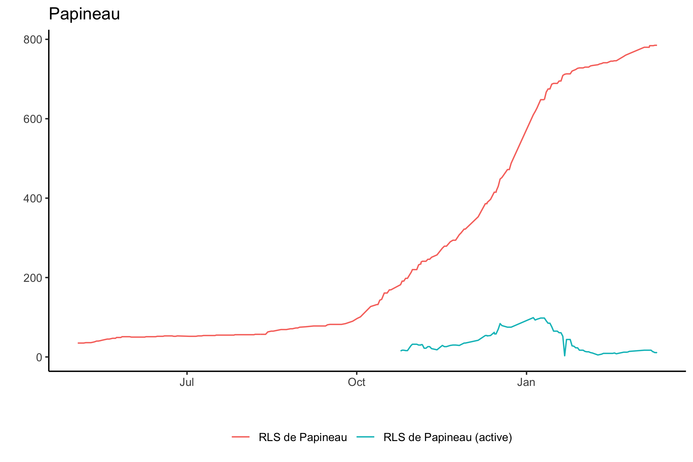
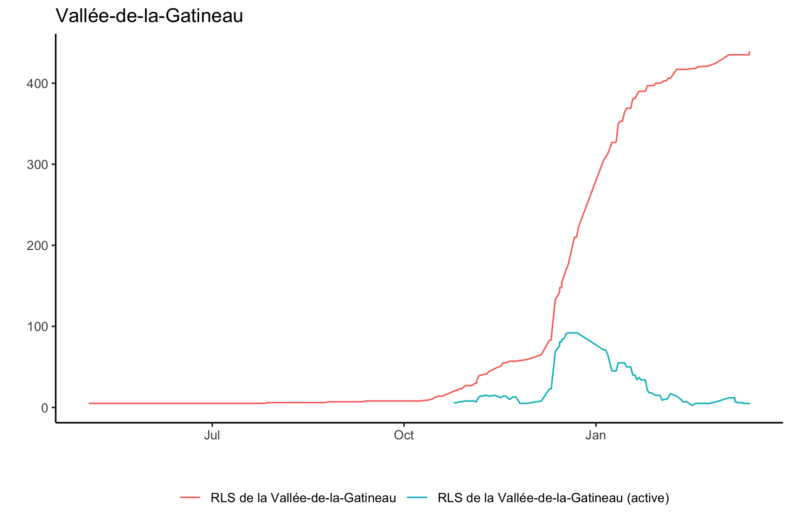
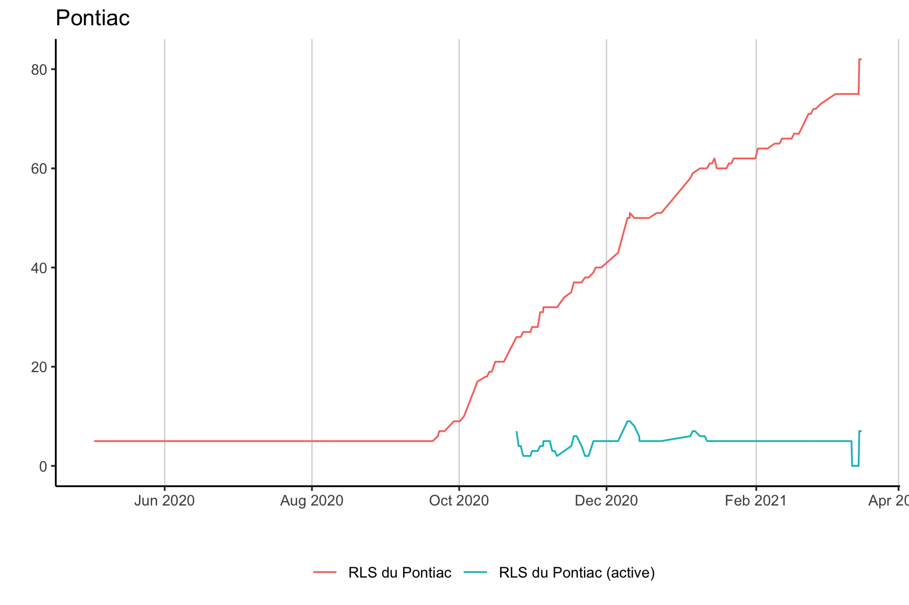
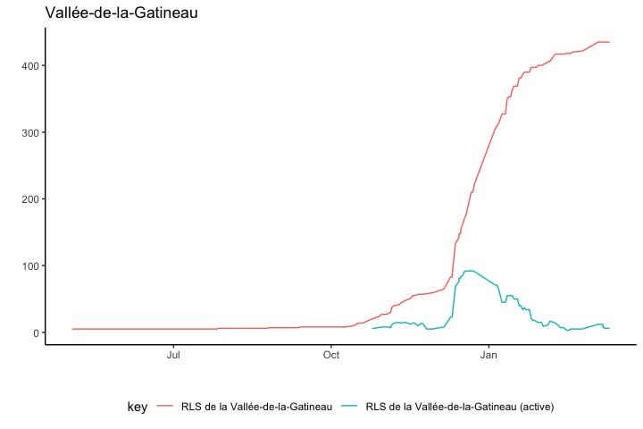
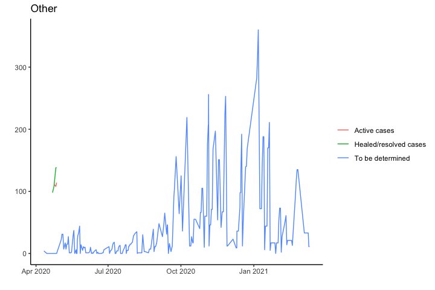

Covid19 Situation in Outaouais
================
Oskar Timo Thoms

-   [Caveats](#caveats)
-   [Outaouais Region](#outaouais-region)
-   [By Réseaux locaux de services
    (RLS)](#by-réseaux-locaux-de-services-rls)
-   [By municipalities](#by-municipalities)

It is difficult to find covid19 trend data at the local level for the
Outaouais. The [Quebec
government](https://www.quebec.ca/en/health/health-issues/a-z/2019-coronavirus/situation-coronavirus-in-quebec/)
shows summaries but only a few days of trend data for regions. [Quebec
Public Health](https://www.inspq.qc.ca/covid-19/donnees) shows longer
time series but only cumulative snapshots by region. The data aggregated
by the [COVID-19 Canada Open Data Working Group](https://opencovid.ca/)
can be used to show trends at the health region level. None of these
sources provide trend data below the regional level. [CISSS
Outaouais](https://cisss-outaouais.gouv.qc.ca/language/en/covid19-en/)
provides frequent (sometimes daily) snapshots by Réseaux locaux de
services (RLS) and by municipality, but no trends.

The present project provides local trend data based on these snapshots.
The HTML source for the [CISSS Outaouais
site](https://cisss-outaouais.gouv.qc.ca/language/en/covid19-en/) is
downloaded daily, the tables are scraped and processed into a tidy
dataset, to produce the figures on this site. The R code for downloading
and processing is made available, but not the software for the daily
automation. (This is currently done with Macscheduler and AppleScript.)
Note several important caveats when consulting the trend data.

# Caveats

1.  There is no guarantee of data accuracy. I am aggregating what CISSS
    Outaouais has been reporting over time. While I do try to correct
    obvious data input error, I have (so far) not implemented an
    automatic error detection process.

2.  The date and time reported in the dataset refer to when the CISSS
    Outaouais website was accessed, not when cases occurred.

3.  The trend data are not complete for several reasons. First, I
    started regularly downloading the CISSS Outaouais website in fall
    2020, and used the [Wayback Machine](https://archive.org/web/) to
    get earlier snapshots. Unfortunately, due to a nasty syncing glitch,
    I lost many of the earlier HTML files. (RStudio projects and Dropbox
    do not play well together; I learnt this the hard way, twice.)
    Second, the CISSS Outaouais site is not updated every day. Third,
    running the code from my personal computer means that the automatic
    download does not happen every day, either because the computer is
    turned off, or because my software for scheduling scripts has failed
    a few times. Since the snapshots include cumulative counts, this is
    not necessarily a problem, but it means that changes in case counts
    cannot always be precisely dated.

4.  Not all the data available on the CISSS Outaouais site are included
    in the dataset.

5.  Over time, CISSS Outaouais has made various changes to what it
    reports and how it labels indicators. While I fix some
    inconsistencies in labels, I do not reconcile closely related
    indicators. The figures show how reporting has changed.

6.  Finally, at the municipal and RLS levels, CISSS Outaouais does not
    report numbers of less than 6 precisely, likely for good privacy
    reasons. When “5 or less” are reported, I record this as 5 cases.
    Consumers of the trend data must be aware that counts of 5 do not
    precisely reflect the actual situation at those levels, but refer to
    1-5 cases.

Last download: 2021-03-12 17:15:02

Last data revision: 2021-03-12 17:02:41

# Outaouais Region

# By Réseaux locaux de services (RLS)

# By municipalities

Page last revised: 2021-03-12 18:00:13.
