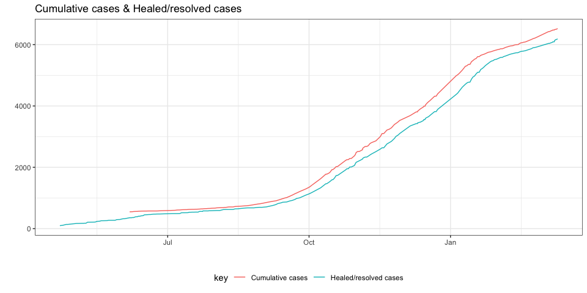
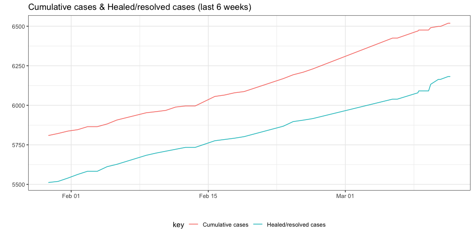
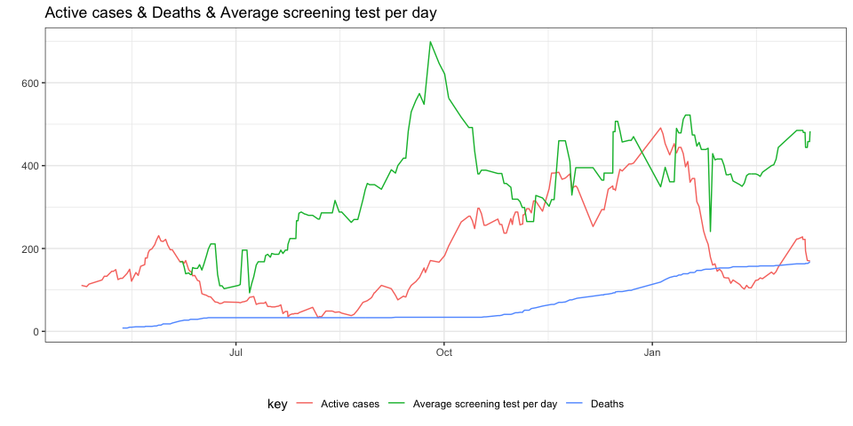
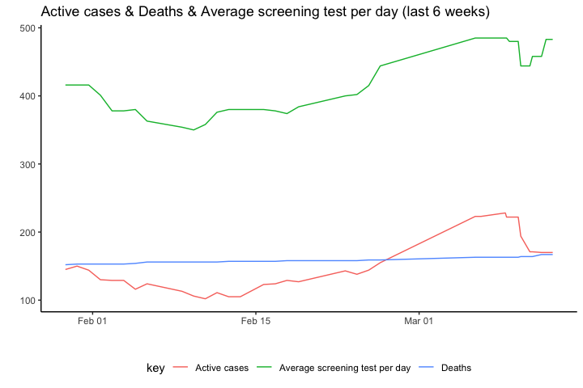

Covid19 Situation in Outaouais
================
Oskar Timo Thoms
11/03/2021

-   [Caveats](#caveats)
-   [Outaouais Region](#outaouais-region)
-   [By RLS](#by-rls)
-   [By Municipalities](#by-municipalities)

It is difficult, if not impossible, to find covid19 trend data at the
local level for the Outaouais. The [Quebec government covid19
website](https://www.quebec.ca/en/health/health-issues/a-z/2019-coronavirus/situation-coronavirus-in-quebec/)
shows summary data but only a few days of trend data for regions. The
[Quebec public health site](https://www.inspq.qc.ca/covid-19/donnees)
shows longer time series but only cumulative snapshots by region. The
best data collection is provided by the [COVID-19 Canada Open Data
Working Group](https://opencovid.ca/) and can be used to show trends at
the health region level. None of these data sources provide trend data
at the local level below the regional level. The [CISSS
Outaouais](https://cisss-outaouais.gouv.qc.ca/language/en/covid19-en/)
provides frequent (sometimes daily) snapshots by Réseaux locaux de
services (RLS) and by municipality, but no trends. This project provides
local covid19 trend data based on these snapshots.

The html code for the [CISSS Outaouais
site](https://cisss-outaouais.gouv.qc.ca/language/en/covid19-en/) is
downloaded daily, the tables are scraped from it, and the data are
extracted and processed into a tidy dataset, to produce the figures on
this site. The R code for downloading and processing is available here,
but not the software for the daily automation. (This is currently done
with Macscheduler and AppleScript, and could be much improved with other
tools.) More could be done with these data but for now I’m keeping it
simple. Please note several important caveats when consulting the trend
data.

## Caveats

1.  There is no guarantee of data accuracy. I am merely aggregating what
    CISSS Outaouais has been reporting over time. While I do try to
    correct obvious data input error, I have so far not implemented an
    automatic error detection process. Moreover, there is no other local
    trend data available to validate against.

2.  The data and time reported in the dataset refer to when the CISSS
    Outaouais website was accessed, not when cases occurred.

3.  The trend data are not complete for several reasons. First, I
    started regularly downloading the CISSS Outaouais covid 19 website
    in fall 2020, and used the [Wayback
    Machine](https://archive.org/web/) to get earlier snapshots.
    Unfortunately, due to a nasty syncing glitch, I lost many of the
    earlier html files. (RStudio projects and Dropbox do not play well
    together; I learnt this the hard way, twice.) Second, the CISSS
    Outaouais site is not updated every day. Third, running the code
    from my home computer means that the automatic download does not
    happen every day, either because the computer is turned off, or
    because my software for scheduling scripts has failed on a few
    occasions. Since the existing snapshots include cumulative counts,
    this is not necessarily a problem for my purpose, but it means that
    changes in case counts cannot always be precisely dated.

4.  Not all the data available on the CISSS Outaouais site are collected
    here. (It would be straightforward to include more information
    available on the site.)

5.  Finally, at the municipal and RLS levels, CISSS Outaouais does not
    report numbers of less than 6 precisely, likely for very good
    privacy reasons. When “5 or less” are reported, I record this as 5
    cases. Consumers of the trend data must be aware that counts of 5 do
    not precisely reflect the actual situation at those levels, but
    refer to 1-5 cases.

Figures updated: 2021-03-11 21:27:22.

## Outaouais Region

<!-- --><!-- --><!-- --><!-- -->

## By RLS

TBA

## By Municipalities

TBA
