Covid19 Situation in Outaouais
================
Oskar Timo Thoms

-   [Outaouais: regional totals](#outaouais-regional-totals)
-   [RLS](#rls)
    -   [New \[TBA\] & active cases](#new-tba--active-cases)
    -   [Cumulative cases](#cumulative-cases)
-   [Municipalities](#municipalities)
    -   [New cases \[TBA\]](#new-cases-tba)
    -   [Cumulative cases](#cumulative-cases-1)
-   [Method and caveats](#method-and-caveats)
-   [Glossary](#glossary)

It is difficult to find covid19 trend data over time at the local level
for the Outaouais region. The [Quebec
government](https://www.quebec.ca/en/health/health-issues/a-z/2019-coronavirus/situation-coronavirus-in-quebec/)
shows summaries but only the last few days of trends for regions.
[Quebec Public Health](https://www.inspq.qc.ca/covid-19/donnees) shows
longer time series but only cumulative snapshots by region. The
[COVID-19 Canada Open Data Working Group
(opencovid.ca)](https://opencovid.ca/) collects official time series
data at the individual, provincial and health region levels. None of
these sources provide trend data below the regional level. [CISSS
Outaouais](https://cisss-outaouais.gouv.qc.ca/language/en/covid19-en/)
provides frequent (sometimes daily) snapshots by Réseaux locaux de
services (RLS) and by municipality, but no trends. The present project
provides local trend data based on these snapshots. Please note
important caveats and data limitations at the bottom of this page.

**Note**: If the figures below do not show the latest data, reload this
page in your web browser.

# Outaouais: regional totals

<!-- ## New & active cases -->
<!-- ## Cumulative cases & deaths  -->
<!-- ## Testing -->

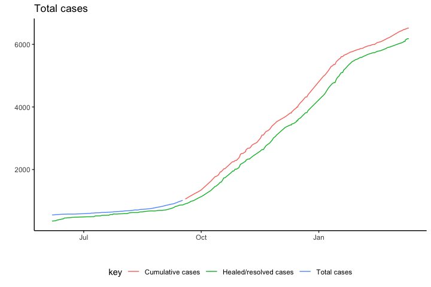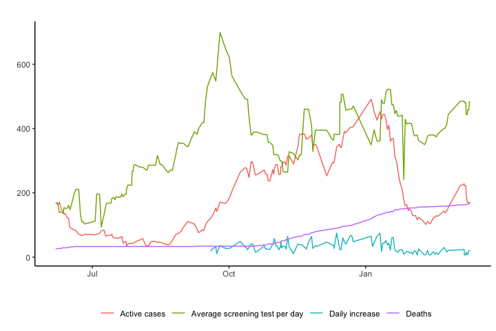

# RLS

## New \[TBA\] & active cases

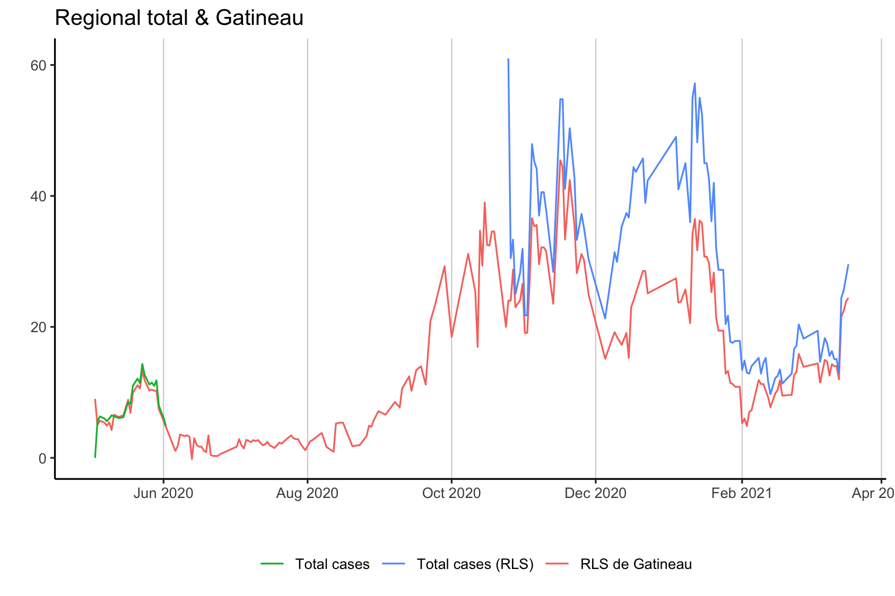

## Cumulative cases

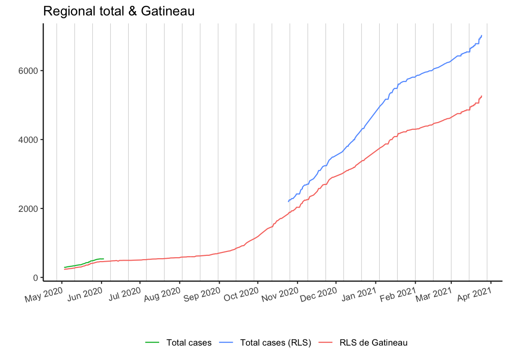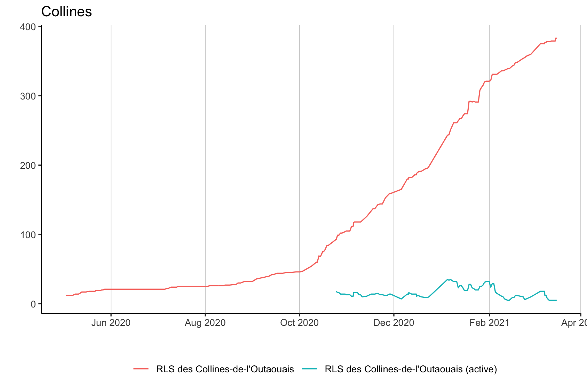

# Municipalities

## New cases \[TBA\]

## Cumulative cases

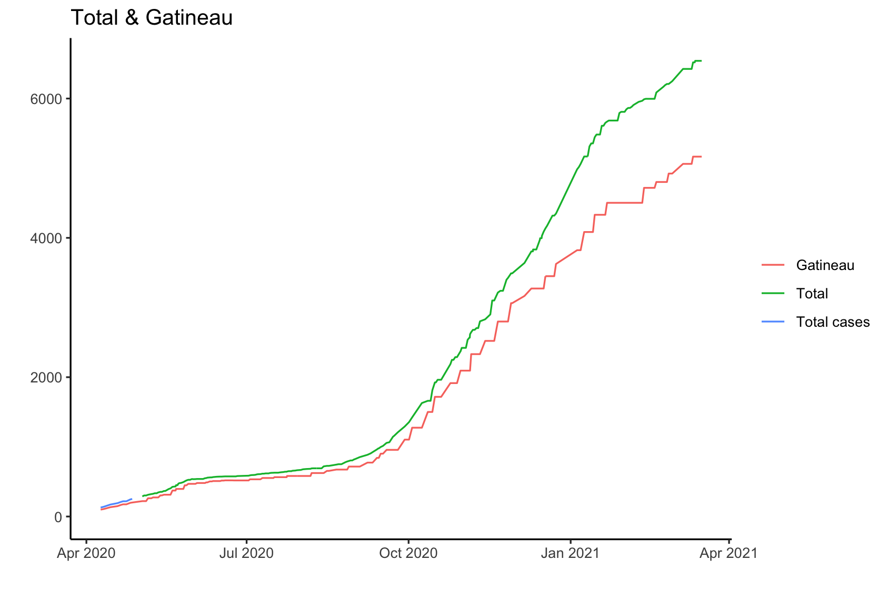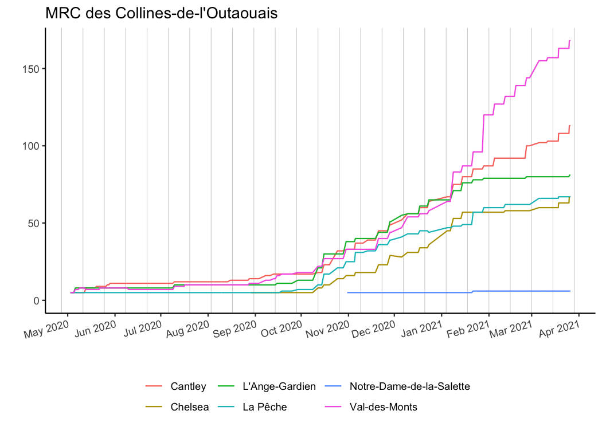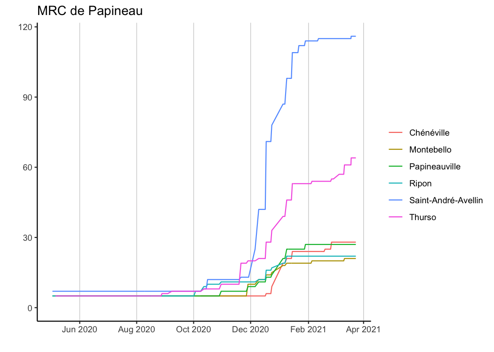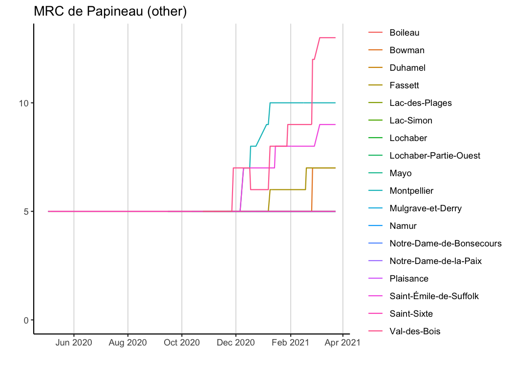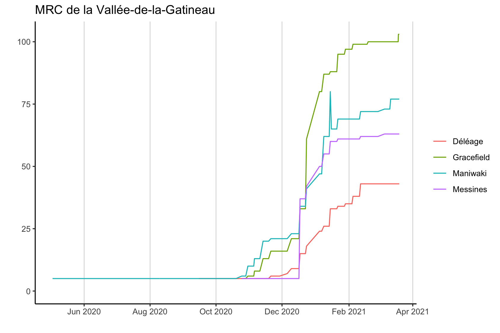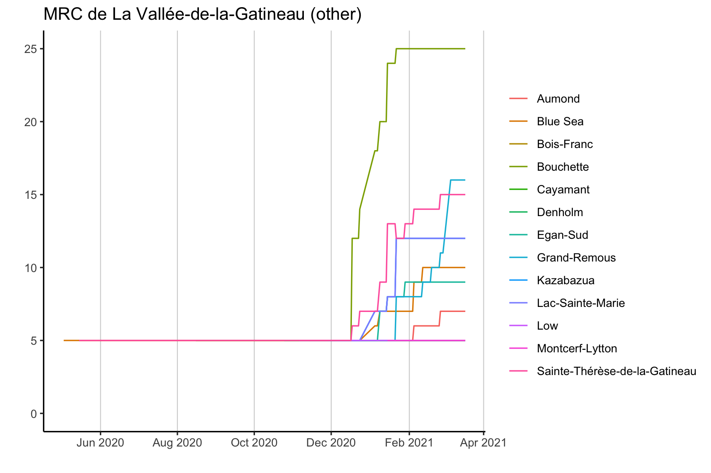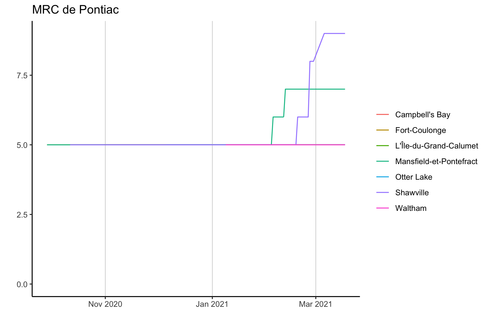

# Method and caveats

The HTML source for the [CISSS Outaouais
site](https://cisss-outaouais.gouv.qc.ca/language/en/covid19-en/) is
downloaded daily, the tables are scraped and processed into a tidy
dataset, to produce the figures on this site. The
[opencovid.ca](https://opencovid.ca/) health region data are included
for comparison. The R code for downloading and processing the data is
available in this repository. (Daily automation is currently done with
MacScheduler.)

Users of these data need to be aware of the following caveats:

1.  There is no guarantee of data accuracy. I am aggregating what CISSS
    Outaouais has been reporting over time. While I do try to correct
    obvious data input error, I have (so far) not implemented an
    automatic error detection process.

2.  The date and time in the dataset refer to when the CISSS Outaouais
    website was accessed, not when cases occurred.

3.  The trend data are not complete (i.e daily) for several reasons.
    First, I started regularly downloading the CISSS Outaouais source in
    fall 2020, and used the [Wayback Machine](https://archive.org/web/)
    to get earlier snapshots. Unfortunately, due to a nasty syncing
    glitch, I lost some HTML source files. (RStudio projects and Dropbox
    do not play well together; I learnt this the hard way, twice.)
    Second, the CISSS Outaouais site is not updated every day. Third,
    running the code from my personal computer means that the automatic
    download does not happen every day, either because the computer is
    turned off, or because my software for scheduling scripts has failed
    a few times. Since the snapshots include cumulative counts, this is
    not necessarily a problem, but it means that changes in case counts
    cannot always be precisely dated.

4.  Not all the data available on the CISSS Outaouais site are currently
    included in the dataset.

5.  Over time, CISSS Outaouais has made changes to what it reports and
    how it labels indicators. While I fix some inconsistencies in
    labels, I do not reconcile closely related indicators. The figures
    show how reporting by CISSS Outaouais has changed.

6.  At the municipal and RLS levels, CISSS Outaouais does not report
    numbers of less than 6 precisely, likely for good privacy reasons.
    When “5 or less” are reported, I record this as 5 cases. Users of
    this dataset must be aware that counts of 5 do not precisely reflect
    the actual situation at those levels, but refer to 1-5 cases.

Last HTML source download: 2021-03-17 11:00:03

Last dataset revision: 2021-03-17 11:00:37

# Glossary

**TBA**

<!-- | Indicator(s)                    | Description                            | -->
<!-- |---------------------------------|----------------------------------------| -->
<!-- | Cumulative/Total cases          | relative, reported                     | -->
<!-- | Active cases                    | relative, reported                     | -->
<!-- | Healed/resolved cases           | regional, reported                     | -->
<!-- | New cases / Daily increase      | regional/relative, reported/calculated | -->
<!-- | Average daily change            | relative, calculated                   | -->
<!-- | Deaths                          | regional, reported                     | -->
<!-- | Average screening tests per day | region, reported, per 6 or 7 days      | -->

Page last revised: 2021-03-17 11:01:16
